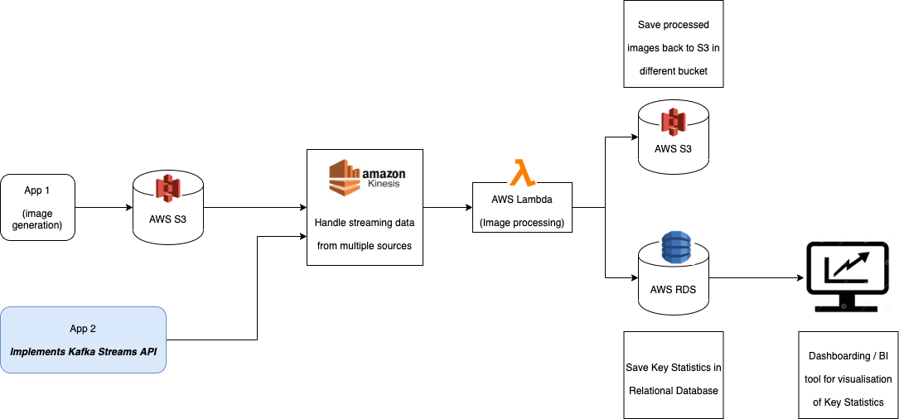

# Section 3: System Design

System design is based on an AWS stack.

## Image Generation
There are two sources of images generation:

1. Application 1 - Collects images uploaded by Customers. Images will be stored in AWS S3.
2. Application 2 - Implements Kafka Streaming API to handle streaming images.

## Image Processing
Propose to use AWS Kinesis + AWS Lambda for image processing.

AWS Kinesis is able to handle sources from both S3 and Kafka Streams. Once Kinesis receives an image, it can call an AWS Lambda function which has the code to process the image.

**Limitations of AWS Lambda functions**

Lambda functions do have some limitations in terms of compute and processing duration. The **assumption** here is that processing a single image is quick. In this case, AWS Lambda functions allows us an event-driven and parallel architecture, where one image triggers a single instance of a Lambda function. Multiple events would trigger multiple Lambda functions to be ran in parallel.  

## Results
Finally the processed images are stored back into S3.

Key statistics are written to AWS RDS - a relational database. A dashboarding tool can be connected to RDS for reporting on Key Statistics.
