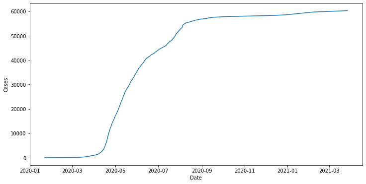

# Section 4: Charts and APIs

Below chart shows the number of Covid19 cases in Singapore over time.
This chart was extracted from the accompanying Jupyter notebook.

Data source [here](https://documenter.getpostman.com/view/10808728/SzS8rjbc#b07f97ba-24f4-4ebe-ad71-97fa35f3b683)

#### High level steps
 - Call API using Python's request module
 - Parse and process data into Pandas dataframe
 - Plot chart using Seaborn
